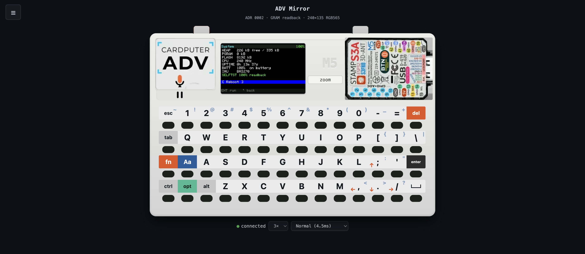
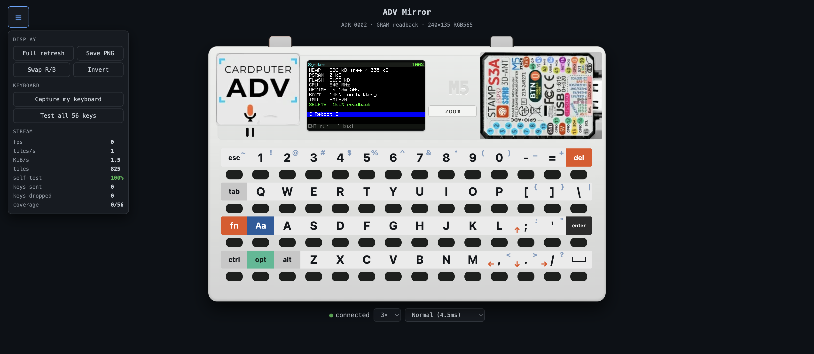
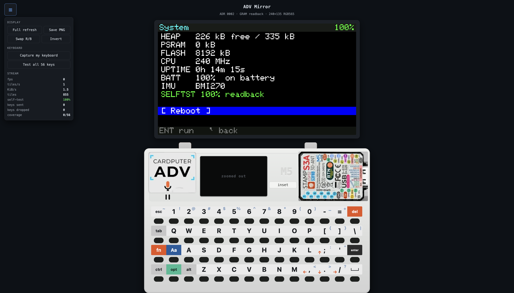

# Cardputer ADV — Display Mirror


**View and control** an **M5Stack Cardputer ADV** from a web browser, over WiFi.
Implements **ADR 0002** (non-invasive GRAM readback) with key injection on top.

## Why you'd want this

- **The real screen, not a simulation.** Pixels come straight off the ST7789's
  own GRAM over 3-wire SPI — no app hooks, no patched firmware. A boot
  self-test reports exactly how reliable that readback is on your unit before
  you trust a single frame.
- **Full remote control, not just viewing.** Click the on-screen keyboard, or
  hit **Capture my keyboard** and use your real one — every key (arrows
  included) lands on the exact matrix coordinate a physical press would use,
  so the firmware can't tell the difference.
- **Mobile-first, and typeable on a phone.** The page is sized for touch by
  default, not shrunk desktop chrome. On a phone, **zoom** pops the display
  up above the case *and* focuses a hidden input that summons your own
  on-screen keyboard in one tap — see [ADR 0045](docs/adr/0045-mobile-first-and-native-keyboard-capture.md).
- **Cuts the cable entirely.** Flash once over USB, then the ADV mirrors *and*
  takes input on WiFi alone — across the room, on battery. Two real bugs (WiFi
  modem sleep, a keystroke counter that lied) used to make control look
  USB-only; both are root-caused and fixed — see **Control over WiFi** below.
- **Multi-client.** More than one browser can watch the same device at once
  (see `2 clients` in the screenshot below).
- **A wire protocol that earns its keep.** Dirty tiles only, RLE-coded: a
  flat or banded tile costs 40 bytes against 5,400 raw — under 1%. The
  worst case (noise) falls back to raw automatically instead of bloating.
- **Tunable, live.** Trade CPU headroom for frame rate on the fly, from
  Gentle (~14 fps) to Aggressive (~18 fps), against a hard ~20.6 fps ceiling
  set by the SPI bus itself.
- **Actually verified, not just claimed.** A fuzzed codec (600 trials, 0
  failures) cross-checked against the shipped browser decoder, an automated
  keyboard-coverage test suite, and 47 ADRs documenting every bug found along
  the way — including the wrong turns.
- **Free.** MIT licensed. No app, no account, no cloud — everything runs on
  the device and in your browser.

```
CardputerMirror.begin();    // setup()  — WiFi + HTTP + WebSocket
CardputerMirror.update();   // loop()   — budgeted scan, pushes changed tiles
```

Browse to the IP printed on the device screen.

> **USB is for flashing only.** There's no OTA path, so `pio run -t upload`
> writes the firmware over the ESP32-S3's native USB CDC. After that the cable
> is not needed for anything — the ADV mirrors *and takes input* on battery.
> If control seems to need the cable, you're on a build from before
> [ADR 0037](docs/adr/0037-control-over-wifi.md); see **Control over WiFi** below.


*The full browser page (ADR 0045's mobile-first pass): "ADV Mirror" title,
the hamburger menu fixed top-left, mirrored System screen, on-screen
keyboard, and connection status — live against a real device (`connected`,
`3x`, `Normal (4.5ms)`).*

The browser page renders the mirrored display alongside a full on-screen
keyboard matching the ADV's physical 4x14 layout — click keys directly to send
them to the device. Prefer typing on your own keyboard? Click **Capture my
keyboard** to toggle passthrough: real keypresses (including arrow keys) are
mapped through the same matrix coordinates a physical press would use, so the
firmware can't tell the difference. On a phone, **zoom** does this for you in
one tap — see **Mobile-first, and typeable on a phone** above.


*Occasional controls and streaming diagnostics live behind the hamburger
(ADR 0027) — Display (full refresh, save PNG, swap R/B, invert), Keyboard
(capture toggle, 56-key test sweep), and live Stream stats (fps, tiles/s,
KiB/s, keys sent/dropped, coverage).*


*Click **zoom** to pop the display out of the case mockup and scale it up
(2x-5x) — as of ADR 0045 it renders ABOVE the case, not below, so it stays
reachable once an on-screen keyboard has taken over the bottom of a phone
screen. The case's own glass shows a "zoomed out" placeholder, with **inset**
to bring the canvas back.*

## Control over WiFi

Keys and display frames share **one WebSocket** (`/ws`). USB is not in the
control path at all — the only thing the firmware reads from serial is a debug
banner. Two defects made control look like it required the cable, and both are
fixed (ADR 0037):



**1. WiFi modem sleep was on because we never chose otherwise.** The Arduino
core defaults to `WIFI_PS_MIN_MODEM` on the S3 and installs it at `STA_START`.
It is asymmetric: *transmitting* wakes the radio, so tile frames always left
immediately, while *receiving* parks between beacons — so every keypress waited
for the next DTIM. A working display beside dead control is exactly what that
produces. USB never caused it; it correlates with it, because a device on the
bench is a metre from the AP and one on battery is across the room. Fixed with
`WiFi.setSleep(false)`.

**2. The page counted keys it never sent.** `send()` returns false when the
socket is down, but every call site incremented the counter regardless — so
presses dropped during the 1200 ms reconnect window were reported as delivered.
`send()` now returns a boolean, all three call sites consume it, and a red
**keys dropped** counter shows the difference.

To tell a link problem from a menu problem, compare the two independent counts —
the browser's **keys sent** against the device's own heartbeat:

```
[   42s] ip=10.88.135.147 clients=1 tiles=8134 keys=27/0 rssi=-58 heap=161284
                                                     ^^^^ applied/dropped
```

Browser counts climbing while `keys=` stays flat means packets aren't arriving —
read `rssi`. Below about **-75 dBm** the answer is an AP or an antenna, not code.

## Why this order (#2 -> #1 -> #4)

The frame source sits behind `IFrameSource`. Swapping ADR 0002's
`ReadbackFrameSource` for ADR 0001's `TeeFrameSource` is a one-line change; the
dirty-tile scheduler, wire protocol, RLE codec and browser UI are shared
verbatim. **ADR 0004 = ADR 0001 + input injection**, so nothing built here is
thrown away. Full reasoning in [`docs/adr/README.md`](docs/adr/README.md).

Starting at #2 first answers the one question source-reading cannot: *does
3-wire GRAM readback actually work on this panel?* The firmware self-tests it at
boot and reports the score in the browser.

## Hardware facts (read from M5 sources, not datasheets)

| Property | Value |
|---|---|
| Board enum | `board_M5CardputerADV = 24` |
| Panel | `Panel_ST7789` 135x240, rotation 1 -> **240x135** |
| SPI | `SPI3_HOST`, write 40 MHz, **read 16 MHz** |
| Pins | MOSI 35, SCLK 36, DC 34, CS 37, RST 33, BL 38 |
| **MISO** | **not wired** (`-1`); `spi_3wire = true` -> half-duplex SIO |
| Read depth | `rgb888_3Byte` — 3 B/px on the wire |
| Keyboard | **TCA8418 I2C**, `matrix(7,8)`, INT **GPIO11** |

## Measured / computed budget

- Shadow framebuffer RGB565: **64,800 B (63.3 KiB)**
- Full-frame readback: 97,200 B -> **48.6 ms @ 16 MHz -> ~20.6 fps ceiling**
- Tile 60x45 (divides 240x135 exactly): 8,100 B -> **4.05 ms**

Codec efficiency, verified by cross-checking the C++ encoder against the shipped
browser decoder (600 fuzz trials + 4 golden vectors, 0 failures):

| Tile content | Wire bytes | vs raw 5,400 B |
|---|---|---|
| Flat fill | 40 | 0.7% |
| Banded | 40 | 0.7% |
| Text-like (sparse) | 856 | 15.9% |
| Noise (worst case) | 5,407 | 100.1% (falls back to RAW) |

## Frame rate vs. application impact

`budgetUs` throttles how much SPI read time `update()` may consume per `loop()`.

| Setting | Tiles/loop | SPI per loop() | Full scan | Realistic fps |
|---|---|---|---|---|
| Gentle (2000us) | 1 | 4.0 ms | 72.6 ms | 13.8 |
| Normal (4500us) | 1 | 4.0 ms | 72.6 ms | 13.8 |
| Fast (9000us) | 2 | 8.1 ms | 60.6 ms | 16.5 |
| Aggressive (20000us) | 4 | 16.2 ms | 54.6 ms | 18.3 |

A full 12-tile scan costs **48.6 ms of SPI time no matter how it is batched**, so
**20.6 fps is an absolute ceiling**. Larger budgets reach it in fewer `loop()`
iterations (less per-iteration overhead), they do not exceed it. Real fps is lower
still: reads contend with the application's own 40 MHz writes. Figures assume ~2 ms
of application work per `loop()`.

## Build

```bash
python3 tools/gen_web_assets.py    # web/index.html -> gzipped PROGMEM header
pio run -t upload
```

Copy `include/wifi_credentials.example.h` to `include/wifi_credentials.h` and
fill in `WIFI_PROFILES` to join your network — that file is gitignored. With no
network reachable the device falls back to a SoftAP, **`CardputerADV`**, and
prints the address on its own screen either way.

## Layout

```
docs/adr/            ADR 0001-0047 — every decision, including the wrong ones
lib/CardputerMirror/ Mirror, IFrameSource, ReadbackFrameSource, RLE codec
web/index.html       Browser client (canvas + 4x14 ADV keyboard) — a template
tools/               Asset generator, MCP server, test suite, codec fuzzer
src/main.cpp         Example integration
src/menu.cpp         On-device menu (Network / System / Mirror / Key Test)
include/             wifi_credentials.h (gitignored) + its example
```

Dropping the mirror into other firmware is `serverHandle()` plus the two marked
lines in `src/main.cpp`; the library owns no policy of its own.

## Known limits (ADR 0002)

- **~20 fps hard ceiling**, lower under load.
- **Tearing** — a tile can be read mid-draw.
- **Missed changes** — content drawn and reverted between two scans of the same
  tile is never seen (CRC sampling).
- **Input is injected, not electrical** — keys are posted into the firmware's own
  queue at the matrix coordinates a physical press would use. Code that reads the
  TCA8418 directly rather than through `M5Cardputer.Keyboard` won't see them.
- **Colors** — if wrong, toggle `Swap R/B` / `Invert`; ST7789 revisions differ.
- A self-test well under 100% means readback is unreliable on your unit; ADR 0001
  is then the path forward.

## Verify the codec locally

```bash
c++ -std=c++17 -O2 -o verify_codec tools/verify_codec.cpp && ./verify_codec
```

## Test suite

```bash
for t in tools/test_*.mjs tools/test_*.cjs; do echo "--- $t"; node "$t"; done
```

| test | what it proves |
|---|---|
| `test_keymap.mjs`       | every coordinate agrees with M5Cardputer's `_key_value_map[4][14]` |
| `test_coverage.mjs`     | every enumerated key is reachable from some painted legend |
| `test_dual_legend.mjs`  | dual-legend caps emit both characters from one coordinate |
| `test_dom_keyboard.cjs` | the page **the device serves** builds the keyboard measured in ADR 0022 |

`test_dom_keyboard.cjs` needs jsdom (`npm install --no-save jsdom`); without it
the test prints SKIP and exits 0 rather than failing.

It gunzips `lib/CardputerMirror/WebAssets.h` rather than reading
`web/index.html`, because the latter is a **template** holding the literal
`/*__KEYMAP__*/` placeholder — opened directly it renders a "keymap missing"
notice and every count assertion reads 0. See ADR 0025.

Regenerate assets after editing `web/index.html`:

```bash
python3 tools/gen_web_assets.py && ./tools/pio.sh run -e cardputer-adv
```

## License

MIT — see [LICENSE](LICENSE).
